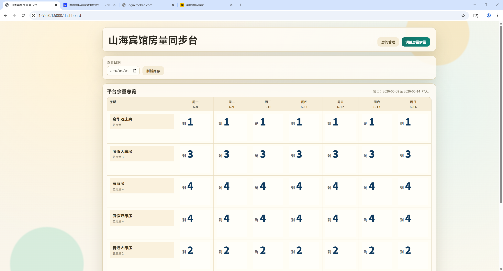
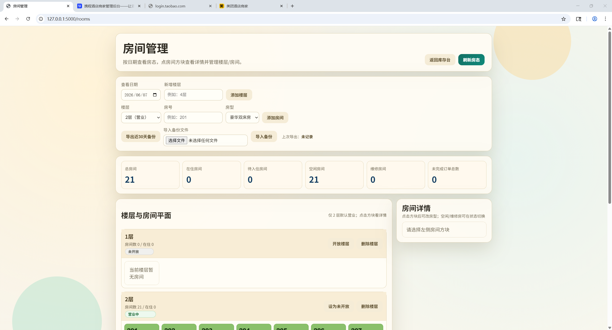
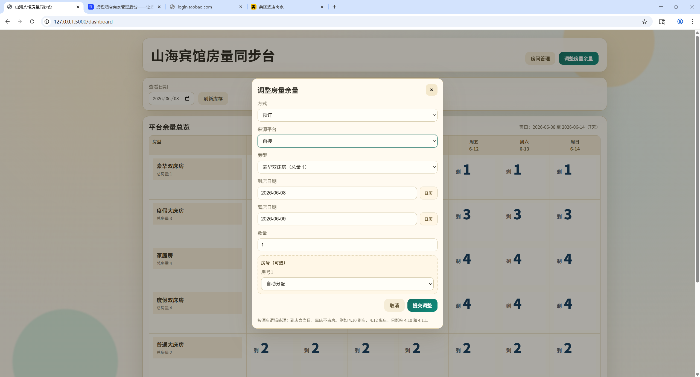

# 山海宾馆房量同步台

这是给小型宾馆使用的本地房量管理工具。软件会在电脑上启动一个本地管理台，并自动打开管理页、携c商家后台、飞z后台、美t后台，方便把库存调整和平台操作放在同一套浏览器窗口里处理。

打包版自带 Chromium 浏览器，不需要用户安装 Python、Playwright，也不需要提前配置账号密码。各平台账号在浏览器页面里正常登录即可，登录状态保存在本机 `sessions` 目录。

## 界面预览

库存总览：



房间管理：



调整房量余量：



## 普通用户怎么安装

到 GitHub Releases 下载安装包：

```text
ShanhaiHotelSync-BundledChromium-Setup.exe
```

双击运行后，软件会安装到当前 Windows 用户目录下，并创建桌面快捷方式和开始菜单入口。安装完成后打开软件，浏览器会自动出现几个标签页：

- 山海宾馆房量同步台
- 携c酒店商家管理后台
- 飞z酒店后台
- 美t酒店商家后台

第一次使用时，在对应平台页面手动登录。遇到验证码、滑块、人脸验证之类的页面，照平台要求人工完成即可。

## 后台和卸载

软件启动后会常驻 Windows 右下角托盘。右键托盘图标，可以打开管理系统或退出软件。

如果托盘图标没出现，先看 Windows 右下角的隐藏图标区域；如果仍然没有，检查安装目录下的 `logs/runtime.log`。新版安装包已经把托盘依赖完整打入包里，旧版缺少 `PIL` 时会导致托盘启动失败。

卸载有两种方式：

- 在开始菜单里点“卸载 山海宾馆房量同步台”
- 在 Windows“应用和功能”里找到“山海宾馆房量同步台”卸载

卸载时可以选择是否保留 `data`、`sessions`、`.env`。保留这些文件后，以后重装还能恢复库存数据和登录状态。

## 主要功能

- 库存总览：按日期查看各房型余量。
- 调整房量：按入住日期、离店日期、房型、来源平台、数量记录预订或取消。
- 房间管理：维护楼层、房间、房型和状态。
- 平台同步队列：本地先记录待同步任务，再由自动化流程尝试写入平台。
- 本地持久化：库存数据放在 `data/inventory_store.json`，登录状态放在 `sessions/`。

## 使用习惯

酒店日期按“入住当天占房，离店当天不占房”处理。比如 4 月 10 日入住、4 月 12 日离店，只影响 4 月 10 日和 4 月 11 日两晚。

如果平台页面改版，自动同步可能失败；这时本地库存不会丢，失败任务会留在同步队列里，后续可以调整 XPath 或改成手工处理。

## 源码里不包含什么

仓库不会上传这些内容：

- `.env`
- `sessions/`
- 真实业务数据 `data/*.json`
- 教程视频
- 打包生成的 `dist/`、`build/`、`releases/`

这些文件会出现在本机运行目录里，但不应该提交到公开仓库。

## 开发运行

需要本机有 Python。建议在虚拟环境里运行：

```powershell
python -m venv .venv
.\.venv\Scripts\Activate.ps1
pip install -r requirements.txt
python -m playwright install chromium
python run_system.py
```

本地管理台地址：

```text
http://127.0.0.1:5000/dashboard
```

常用参数：

```powershell
python run_system.py --login-platform none
python run_system.py --login-platform all
python run_system.py --no-startup-tabs
python run_system.py --no-tray
```

`--login-platform all` 会按携程、飞猪、美团的登录流程跑一遍；实际使用中更常见的是直接让浏览器打开平台页面，在网页里人工登录。

## Windows 打包

打包脚本在 `build_windows.ps1`。默认是窗口程序，不会弹黑色命令行窗口：

```powershell
powershell -ExecutionPolicy Bypass -File .\build_windows.ps1
```

如果要生成给普通用户下载的离线版，使用自带 Chromium 的模式：

```powershell
powershell -ExecutionPolicy Bypass -File .\build_windows.ps1 -BundleBrowser
```

输出目录：

```text
dist\ShanhaiHotelSync
```

构建 GitHub Release 安装包时，先压缩 `dist\ShanhaiHotelSync` 为 `ShanhaiHotelSync-bundled.zip`，再用 `installer\installer_app.py` 生成单文件安装器。安装器会包含：

- 应用本体
- Chromium 运行目录
- `Uninstall.exe`
- 桌面快捷方式
- 开始菜单入口
- Windows 卸载注册项

## 目录说明

```text
inventory_app.py       本地管理台后端
run_system.py          一键启动入口，负责托盘、浏览器标签页、Flask 服务
login_manager.py       平台登录和浏览器会话管理
platform_sync.py       平台同步任务逻辑
templates/             页面模板
static/                前端脚本、样式和图标
installer/             安装器和卸载器源码
picture/               README 用截图
```

## 版本发布

安装包体积比较大，因为包含 Chromium。源码仓库只放代码和截图，安装包放到 GitHub Releases。

发布前建议至少检查工作区状态，并确认没有把本机数据、登录状态或真实业务数据提交进去：

```powershell
git status --short
```

如果要校验安装包是否被改动，可以对 `.exe` 计算 SHA256。下载者拿到同一个文件时，算出来的 SHA256 应该和 Release 页面写的一样。


## 备注

不得用于商业用途，禁止二次分发。仅供个人学习和参考。如需商业用途请联系作者：a1091122371 AT gmail.com
